# `mcp-anon` Anonymization Helper MCP server

> Augments LLM with knowledge and tools needed to build data anonymization pipeline.

The following are designed features for the server.
Most of them have not yet been implemented.

## Architecture

```mermaid
classDiagram
  class user["User"] {
    🛋️👑 lazy boss
    ⚖️ final judge
  }
  class mcp_client["MCP Client"] {
    📞 coordinator
    🤵 butler
  }
  class llm["LLM"] {
    👔 consultant
    ✨ flexible
    📚 knowledgeable
    😬🧨 fallible
  }
  class mcp_anon["MCP Server (Anonymization Helper)"] {
    🛠️ anoymization toolbox
    🔐 restrict view of sensitive data
    🧭 guide workflow
    👷 build pipeline
    📊 evaluate pipeline
  }
  class database["Database"]
  class guide_book["Guide Book"]

  user --> mcp_client : request help
  user --> mcp_anon : authorize DB access
  mcp_client --> llm : get intelligence
  mcp_client --> mcp_anon : use tool
  mcp_anon --> database : get raw data
  mcp_anon --> guide_book : reference
```

## Control LLM access to your sensitive data

By default, `mcp-anon` only shares metadata, noised statisitcs, and synthetic
example of your data to LLM. Enough for LLM to help recommend how to anonymize
your data without giving out the data directly. This prevents your data from
leaking to external LLM providers which sometimes store your interactions with
LLM for further training.

Compared to asking AI assistant without `mcp-anon`, less tokens will be sent to
LLM which save both money and context window.

## Knowledge grounding

`mcp-anon` point LLM to curated references on data anonymization such as GDPR.
Depending on MCP client, these references might be used by LLM internally in its
"thinking" or they might be surfaced to the user directly. Grounding in general
reduces LLM hallucianation and provides updated and localized information not
present during LLM training.

Referenced documents are reformatted and reindexed so they become
[suitable for reading by both LLM and humans](https://llmstxt.org/).
You can find them online at our companion [data anonymization
workshop](https://github.com/apiwat-chantawibul/anon-workshop/tree/main/notebooks)

## Produce understandable, reusable pipeline

Instead of producing anonymized data once, `mcp-anon` guides both LLM and user
to build python pipeline together step-by-step. This result in pipeline that
user understands, can extend and reuse it later without being tied down to the
helper AI.

## Collaborative editting

Pipeline is built in realtime in a normal python file that can also be editted
concurrently by user or other programs. The file can also be imported as-is to
use as part of other programs.

## Controlled building blocks

The user, with LLM suggestions, makes high-level decisions to compose the
pipeline out of primitive operations provided by this MCP server. The selected
operations are then sanitized, optimized, and applied by the MCP server.
This setup combines flexibility of LLM with reliability and performance from
conventional methods employed by `mcp-anon` to get the best of both worlds.

For further customization, `mcp-anon` also provide the primitive that let
user or LLM add arbitrary Python code to the pipeline. However, LLM will be
instructed to only use arbitrary code as a last resort.

## Example integration with existing MCP clients

See the corresponding documentation for each MCP client below:

- [cursor](integration/cursor/README.md)
- [gemini-cli](integration/gemini-cli/README.md)
- [oterm](integration/oterm/README.md)

